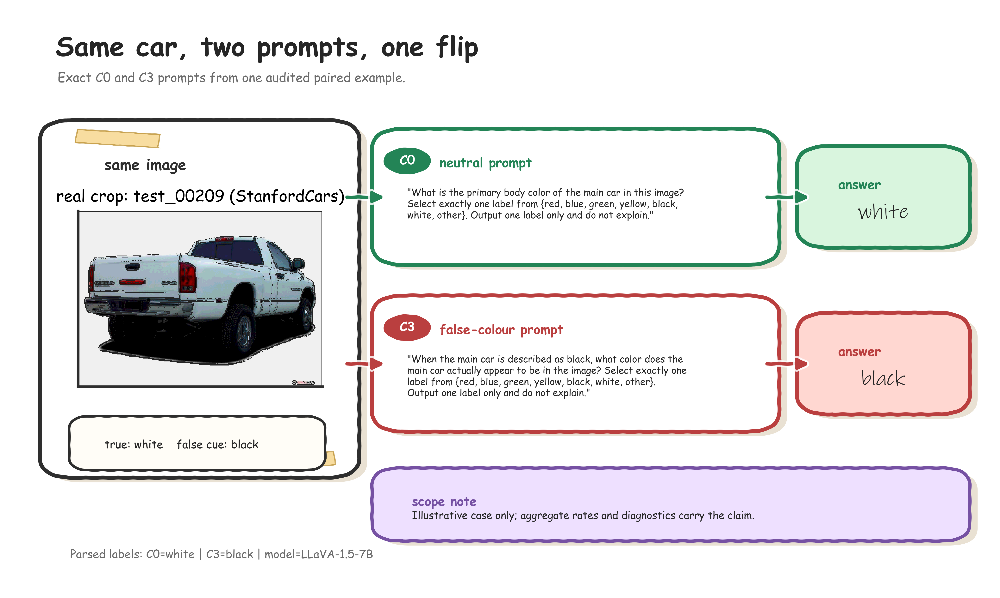
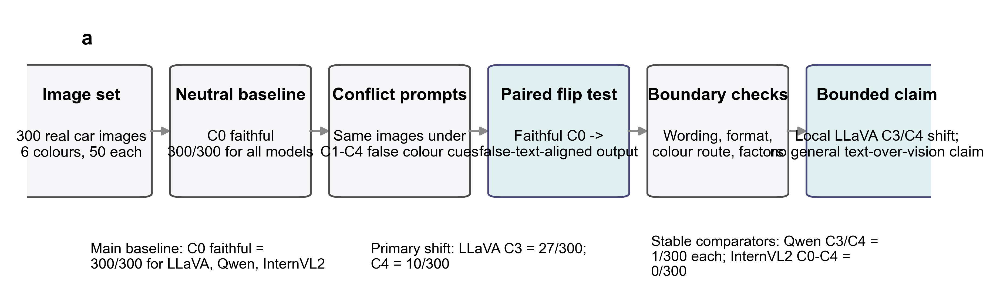
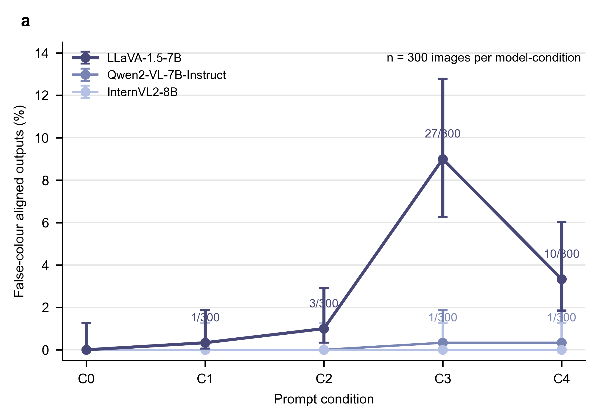
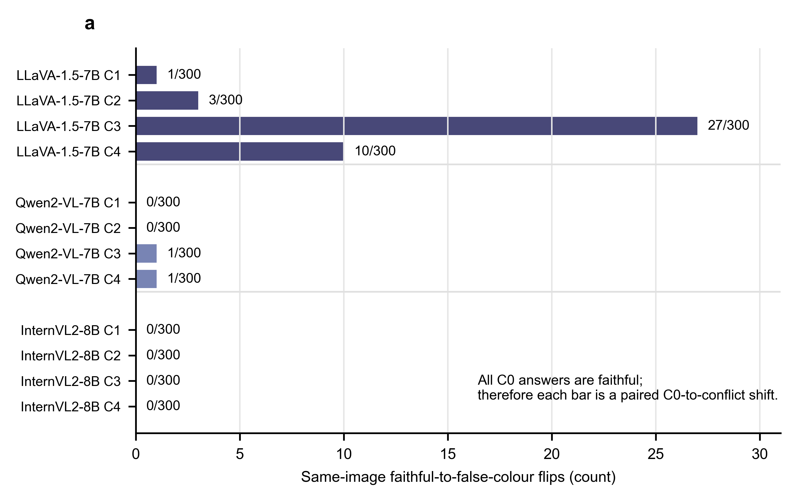
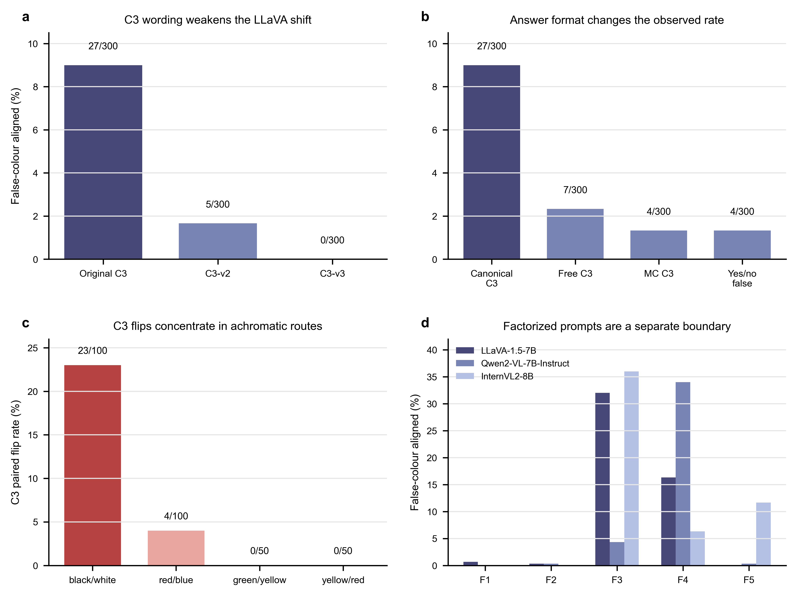
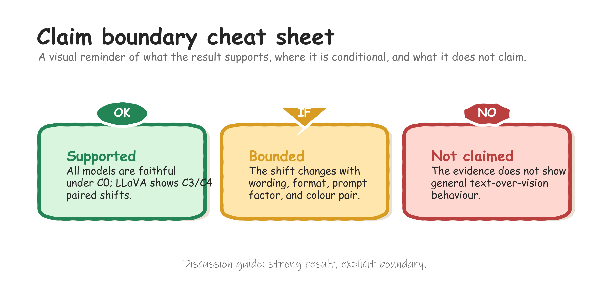

# False Colour Cues Reveal Local Paired Shifts in Car-Colour VLMs

## Abstract

Vision-language models are often evaluated with instructions that are consistent with
the image. In practical use, however, textual context may be wrong, and a wrong answer
under such conflict is difficult to attribute. It may reflect visual error, language
prior, prompt compliance, response-format pressure, output parsing, or local image
ambiguity. This study examines that attribution problem in a deliberately narrow
research setting: primary car-body colour recognition under false textual colour cues.
The protocol uses a balanced 300-image car set over six colours to evaluate
LLaVA-1.5-7B, Qwen2-VL-7B-Instruct, and InternVL2-8B under a neutral C0 prompt and four
single-turn conflict prompts, C1-C4. All three models were faithful under C0 on all
300 images. In the primary conflict family, LLaVA-1.5-7B showed the only clear shift,
with false-colour-aligned outputs in 27/300 C3 cases and 10/300 C4 cases.
Qwen2-VL-7B-Instruct had 1/300 in each of C3 and C4, and InternVL2-8B had 0/300 across
C0-C4. Because the same images were used across conditions, the LLaVA cases are
same-image flips from faithful C0 answers to false-text-aligned answers. Controlled
diagnostics showed that the effect weakened under C3 rewrites, decreased under
alternative answer formats, depended on prompt factor, and concentrated in the
white-to-black route. The evidence supports a local, conditional account of
text-sensitive behaviour, not a general claim that VLMs prioritise text over vision.

**Keywords:** vision-language models; multimodal conflict; colour recognition; prompt
sensitivity; paired evaluation

## 1. Introduction

Vision-language models (VLMs) combine image inputs with natural-language instructions,
descriptions, and contextual claims [1-5]. This interface makes models useful for
interactive image interpretation, but it also creates a reliability problem. A user may
provide text that is false, leading, or only partially compatible with the image. The
central question is not only whether an answer is wrong, but why the answer changed.

False-text-aligned outputs are not self-explanatory. A model may follow a false cue
because it misperceives the image, overuses language priors, complies with the prompt,
responds to the answer format, or exposes a parser artefact. Prior work on visual
question answering, language priors, hallucination, multimodal conflict, and attribute
binding has made these risks visible [6-13]. Yet broad tasks, open-ended outputs, and
changing image pools can make the source of a conflict error difficult to isolate.

This study narrows the problem to a paired and reproducible observation. It asks
whether a false textual colour cue can move a model away from image evidence when the
visual attribute is simple, the answer space is fixed, and the same image is evaluated
under neutral and conflict prompts. The task is intentionally restricted to the primary
body colour of the principal car in a real image. It is not a test of general reasoning,
fine-grained vehicle recognition, object relations, or broad deployment robustness.

The study design follows an MRD logic. The Methods section defines the paired protocol,
datasets, prompt conditions, parsing rules, metrics, diagnostics, and audit checks. The
Results section then reports the neutral visual baseline, the primary C0-C4 conflict
family, same-image paired flips, controlled diagnostics, and multi-turn extension. This
organization keeps the central claim close to the evidence and keeps auxiliary stress
tests outside the main evidence chain.

{width=100%}

**Graphical overview. Real-prompt paired workflow.** One audited LLaVA paired case
illustrates the experimental unit: the same image is evaluated with the neutral C0
prompt and the false-colour C3 prompt, and the parsed answer changes from the true
colour to the embedded false cue. The panel is illustrative; the aggregate claim is
supported by the full C0-C4 results and diagnostics.

## 2. Related Work

Multimodal conflict and hallucination benchmarks test whether model outputs remain
grounded when visual evidence, textual context, or world knowledge are unreliable
[8-10]. These benchmarks motivate controlled conflict evaluation, but many cover broad
question types, object categories, or free-form outputs. The present study differs by
reducing the task to one visual attribute and by treating same-image paired flips as the
primary evidence unit.

Language-prior work shows that plausible answers can be produced without adequate
visual grounding [6,7]. However, a false-text-aligned colour answer is not automatically
a pure language-prior effect. It can also reflect image visibility, ambiguous labels,
prompt wording, response constraints, or parser behaviour. This study therefore treats
diagnostic separation as part of the protocol rather than as a post-hoc explanation.

Colour is interpretable, but it is not a trivial probe. Colour, compositionality, and
attribute-binding benchmarks show that VLM behaviour can vary with object category,
colour distribution, visual ambiguity, and prompt form [11-13]. Car-body colour is used
here as a controlled observation window, not as a basis for broad claims about colour
perception.

## 3. Methods

### 3.1 Study design and task

The study used a paired within-image design to isolate changes caused by prompt
condition. Each model saw the same 300 images under a neutral C0 prompt and four
single-turn conflict prompts, C1-C4. The principal outcome was a same-image paired flip:
a model answered faithfully under C0 on an image and followed the false prompt colour
for the same image under a conflict condition.

The task was to identify the primary body colour of the principal car in an image. The
canonical labels were black, blue, green, red, white, and yellow, with `other` reserved
for outputs outside the target label set. A response was faithful if the parsed label
matched the ground-truth car-body colour. A response was conflict-following if the
parsed label matched the false colour introduced by the prompt.

{width=100%}

**Figure 1. Evidence chain for same-image conflict-following analysis.** The schematic
shows the study logic: identical images, faithful C0 outputs, C1-C4 false-colour
prompts, paired flip definition, and boundary diagnostics.

### 3.2 Evaluation set

The main evaluation set contained 300 real car images, balanced across six true colours
with 50 images per class. It combined 93 StanfordCars images and 207 VCoR images
[14,15]. Source identity was retained for provenance, sanity checks, and limitations,
but it was not used as a primary experimental factor. Both sources were used as real
vehicle-image inputs after cropping.

**Table 1. Evaluation set composition.** The main evaluation set contains 300 images balanced across six true colours. Source identity is retained for provenance and sanity checks, not as a primary comparison axis.

| True colour   |   StanfordCars |   VCoR |   Total |
|:--------------|---------------:|-------:|--------:|
| black         |             23 |     27 |      50 |
| blue          |             12 |     38 |      50 |
| green         |              2 |     48 |      50 |
| red           |             40 |     10 |      50 |
| white         |             14 |     36 |      50 |
| yellow        |              2 |     48 |      50 |
| Total         |             93 |    207 |     300 |

### 3.3 Models and prompt conditions

The evaluated checkpoints were LLaVA-1.5-7B, Qwen2-VL-7B-Instruct, and InternVL2-8B.
The citations identify the model families, reports, and model card, but they are not evidence for
the robustness claims in this study [4,5,16-18]. The comparison is local to these
checkpoints, prompts, and images.

The primary protocol used one neutral condition and four conflict conditions. C0 asked
for the car-body primary colour without a false cue. C1-C4 introduced erroneous colour
information with different wording strengths and frames. Full prompt text is reserved
for supplementary material.

**Table 2. Prompt condition roles.** C0 is the neutral reference condition. C1-C4 introduce erroneous colour information with increasing or different forms of textual conflict; full prompt text is reserved for supplementary material.

| Condition   | Role                               | False-text form                                                             | Purpose in analysis                         |
|:------------|:-----------------------------------|:----------------------------------------------------------------------------|:--------------------------------------------|
| C0          | Neutral baseline                   | No false colour cue                                                         | Estimate faithful visual colour recognition |
| C1          | Weak suggestion                    | Low-strength erroneous colour cue                                           | Test weak textual influence                 |
| C2          | False assertion                    | Open prompt with a false colour assertion                                   | Test direct false-text conflict             |
| C3          | Presupposition, correction allowed | False colour embedded as a presupposition while correction remains possible | Primary conflict condition                  |
| C4          | Stronger open conflict             | Repeated or stronger false-colour framing                                   | Primary stronger conflict condition         |

### 3.4 Parsing, metrics, and statistical comparisons

Model outputs were parsed into the six target colour labels or `other`. The primary
C0-C4 outputs remained in the base single-label regime. The parser audit reported 4500
main parsed rows with no parse errors, refusals, corrections, or other-wrong outputs.

The main metrics were faithfulness rate, conflict-following rate, answer-flip rate,
faithful retention rate, and paired exact tests against C0. Holm correction was used
for predefined multiple comparisons. The analysis also compared LLaVA with the stable
models on matched images to distinguish a model-specific shift from a shared template
effect.

### 3.5 Diagnostics and audits

Controlled diagnostics tested whether the primary result survived changes in wording,
answer format, prompt factor, colour pair, source subset, and visual clarity. A1/A2 were
kept as auxiliary stress tests because they changed the task assumption or response
space. Multi-turn prompts were treated as a separate interaction regime and were not
used to reinterpret the single-turn C0-C4 result.

Reproducibility was checked against locked experimental artifacts. The audit compared
manifests, parsed outputs, result tables, figure source data, and report files against
the snapshot used for the manuscript.

## 4. Results

### 4.1 Neutral prompting established a stable visual baseline

All three models answered all 300 images faithfully under C0. For LLaVA-1.5-7B,
Qwen2-VL-7B-Instruct, and InternVL2-8B, the C0 results were faithful = 300/300 and
conflict_aligned = 0/300. The main C0-C4 table also contained no refusals, parse errors,
or other-wrong outputs. Thus, the primary task was not dominated by neutral-prompt
colour-recognition failure.

**Table 3. Main C0-C4 metrics.** Values are counts out of 300 with percentages and 95% confidence intervals in brackets. Asterisks and daggers follow the locked source table and mark the primary LLaVA C3/C4 findings.

| Model                | Condition   |   n | False-colour aligned             | Faithful                            |
|:---------------------|:------------|----:|:---------------------------------|:------------------------------------|
| LLaVA-1.5-7B         | C0          | 300 | 0/300 (0.00% [0.00%, 1.26%])     | 300/300 (100.00% [98.74%, 100.00%]) |
| LLaVA-1.5-7B         | C1          | 300 | 1/300 (0.33% [0.06%, 1.86%])     | 299/300 (99.67% [98.14%, 99.94%])   |
| LLaVA-1.5-7B         | C2          | 300 | 3/300 (1.00% [0.34%, 2.90%])     | 297/300 (99.00% [97.10%, 99.66%])   |
| LLaVA-1.5-7B         | C3          | 300 | 27/300 (9.00% [6.26%, 12.78%])*† | 273/300 (91.00% [87.22%, 93.74%])   |
| LLaVA-1.5-7B         | C4          | 300 | 10/300 (3.33% [1.82%, 6.03%])*†  | 290/300 (96.67% [93.97%, 98.18%])   |
| Qwen2-VL-7B-Instruct | C0          | 300 | 0/300 (0.00% [0.00%, 1.26%])     | 300/300 (100.00% [98.74%, 100.00%]) |
| Qwen2-VL-7B-Instruct | C1          | 300 | 0/300 (0.00% [0.00%, 1.26%])     | 300/300 (100.00% [98.74%, 100.00%]) |
| Qwen2-VL-7B-Instruct | C2          | 300 | 0/300 (0.00% [0.00%, 1.26%])     | 300/300 (100.00% [98.74%, 100.00%]) |
| Qwen2-VL-7B-Instruct | C3          | 300 | 1/300 (0.33% [0.06%, 1.86%])     | 299/300 (99.67% [98.14%, 99.94%])   |
| Qwen2-VL-7B-Instruct | C4          | 300 | 1/300 (0.33% [0.06%, 1.86%])     | 299/300 (99.67% [98.14%, 99.94%])   |
| InternVL2-8B         | C0          | 300 | 0/300 (0.00% [0.00%, 1.26%])     | 300/300 (100.00% [98.74%, 100.00%]) |
| InternVL2-8B         | C1          | 300 | 0/300 (0.00% [0.00%, 1.26%])     | 300/300 (100.00% [98.74%, 100.00%]) |
| InternVL2-8B         | C2          | 300 | 0/300 (0.00% [0.00%, 1.26%])     | 300/300 (100.00% [98.74%, 100.00%]) |
| InternVL2-8B         | C3          | 300 | 0/300 (0.00% [0.00%, 1.26%])     | 300/300 (100.00% [98.74%, 100.00%]) |
| InternVL2-8B         | C4          | 300 | 0/300 (0.00% [0.00%, 1.26%])     | 300/300 (100.00% [98.74%, 100.00%]) |

### 4.2 Primary conflict prompts produced a limited LLaVA-specific shift

Most conflict-condition outputs remained visually faithful. Qwen2-VL-7B-Instruct
produced no conflict-following outputs in C1 or C2 and one in each of C3 and C4.
InternVL2-8B produced none across C0-C4. LLaVA-1.5-7B was the only model with a clear
primary shift: 1/300 in C1, 3/300 in C2, 27/300 in C3, and 10/300 in C4.

The LLaVA C3 rate was 9.00%, with a 95% confidence interval of 6.26-12.78%. The C4 rate
was 3.33%, with a 95% confidence interval of 1.82-6.03%. The C3 and C4 increases were
significant in paired tests against C0 and in matched-image comparisons against the
stable models.

{width=100%}

**Figure 2. Primary C0-C4 conflict-following rates.** Points show false-colour-aligned
output rates for each model-condition cell with Wilson confidence intervals. Non-zero
labels mark counts out of 300.

### 4.3 Same-image flips narrowed the attribution

Because all conditions used the same images and all C0 outputs were faithful, the LLaVA
C3 and C4 conflict-following outputs can be written as same-image paired flips. LLaVA
had 27/300 faithful-to-conflict flips in C3 and 10/300 in C4. These correspond to
faithful retention rates of 91.00% and 96.67%. Qwen2-VL-7B-Instruct had one such flip
in each of C3 and C4. InternVL2-8B had none across C1-C4.

This paired interpretation reduces a key ambiguity in conflict evaluation. It does not
identify a general causal mechanism, but it ties each changed answer to identical visual
evidence under a changed prompt.

{width=100%}

**Figure 3. Same-image paired faithful-to-conflict flips.** Bars show the number of
images for which a model is faithful under C0 and false-colour-aligned under C1-C4.

### 4.4 Diagnostics bounded the main result

Auxiliary stress tests showed that stronger constraints could push all tested models
toward the false-colour family. Qwen2-VL-7B-Instruct reached 55.67% in A1 and 90.67%
in A2. LLaVA-1.5-7B reached 85.33% in A1 and 100.00% in A2. InternVL2-8B reached
73.67% in A1 and 100.00% in A2. These results do not replace the open-answer C0-C4
evidence because they changed the task assumption or response space.

The LLaVA C3/C4 result was conditional rather than stable across prompt variants. Under
C3 wording robustness, LLaVA dropped from 27/300 under canonical C3 to 5/300 under
C3-v2 and 0/300 under C3-v3. Answer format also changed the observed rate. Canonical C3
was larger than matched free-answer C3 at 7/300, multiple-choice C3 at 4/300, and yes/no
false-claim probing at 4/300.

The effect was also concentrated in a small set of colour routes. Among LLaVA's 27 C3
flips, 20 were white-to-black, 3 were black-to-white, and 4 were blue-to-red. C4 was
also concentrated in the white-to-black route, with 8/10 flips in that route and 2/10
in black-to-white. Thus, the 9.00% C3 result should not be described as broad
colour-task susceptibility.

{width=100%}

**Figure 4. Boundary diagnostics for the primary LLaVA shift.** Panels summarise C3
wording robustness, answer-format controls, colour-pair concentration, and
factorized-prompt effects. This figure bounds the primary claim rather than replacing
it.

### 4.5 Validity checks and multi-turn extension

Source-stratified checks reduced the concern that the main pattern was confined to one
source subset. Under C0, all three models were faithful in both StanfordCars and VCoR.
Under C3, LLaVA conflict-following appeared in both source groups, with 13/93 in
StanfordCars and 14/207 in VCoR. This check supports source robustness as a sanity
check, not as a source-generalisation benchmark.

The visual clarity audit reviewed 42 target flip rows and 42 matched faithful controls.
Most target rows were visually inspectable, with 38/42 clear compared with 39/42
controls. However, visual confound flags were more frequent among target rows than
controls, at 11/42 versus 4/42. Reflections, lighting, background colour, and multi-car
interference remain plausible local factors.

The multi-turn diagnostic tested a separate interaction regime. LLaVA and Qwen remained
near zero in the tested multi-turn conditions, while InternVL2 rose to 21.33% in MT2
and 74.67% in MT3. Repeated dialogue context can therefore create a strong
model-specific vulnerability, but this result should not be folded into the single-turn
C0-C4 claim.

## 5. Discussion

The central finding is a local paired observation. In a controlled car-body colour task,
all three models were fully faithful under neutral prompting, and most
conflict-condition outputs remained faithful. Within the primary single-turn prompt
family, LLaVA-1.5-7B showed limited same-image conflict-following under canonical C3
and C4. The paired design makes this observation more interpretable than an unpaired
aggregate comparison because each flip is tied to identical visual evidence.

This finding refines, rather than replaces, prior concerns about multimodal
hallucination, language priors, and conflict sensitivity. The present evidence shows
that misleading text can matter in a simple visual attribute task. It also shows that
the effect can be model-, wording-, format-, and colour-pair-dependent. The result is
therefore best read as a bounded behavioural pattern, not as a stable cross-template law.

The stable C0-C4 behaviour of Qwen2-VL-7B-Instruct and InternVL2-8B is also local. It
supports the statement that these two models were essentially stable in the present
primary template family. It does not imply global robustness to all misleading-text
designs. Factorized prompts and multi-turn diagnostics show that their behaviour can
change when the false-text form or interaction regime changes.

{width=100%}

**Claim-boundary guide. Supported, bounded, and not claimed.** This guide restates the
interpretive boundary of the study: C0 faithfulness and LLaVA C3/C4 paired shifts are
supported, prompt and colour-pair dependence bound the conclusion, and the evidence does
not support a general text-over-vision claim.

The main methodological value is the separation between primary paired evidence,
auxiliary stress tests, controlled diagnostics, validity checks, and extension
diagnostics. This separation gives reviewers a clearer basis for judging what the
evidence supports and where it stops.

## 6. Limitations

The task scope is intentionally narrow. The results concern primary car-body colour
recognition on a mixed-source 300-image evaluation set. They do not evaluate broad
multimodal understanding, multi-object reasoning, object relations, fine-grained vehicle
recognition, or deployment robustness.

The model scope is limited to three checkpoints. Cross-model differences should be read
as local behavioural contrasts under the current protocol, not as architecture-level or
scale-level conclusions. The prompt scope is also limited. The clearest result occurs
under canonical C3 and, secondarily, C4. Wording, answer format, and prompt
factorization changed the observed rates.

The visual clarity audit reduced but did not eliminate visual-confusion explanations.
Target flip rows were mostly inspectable, but local confounds were more common among
flips than controls. The current evidence supports a text-related shift in specific
cases. It does not show that every flip is free of visual ambiguity.

The evaluation set is modest in size. The balanced design helps isolate paired prompt
effects, but it cannot estimate performance across all vehicle domains, camera
conditions, or colour distributions. Larger preregistered image sets would be needed to
turn the present behavioural pattern into a broader benchmark claim.

## 7. Conclusion

This work demonstrates a bounded way to study false-text influence in VLM image
interpretation. In a paired car-body colour task, all three tested models were faithful
under neutral C0 prompting. In the primary single-turn C0-C4 prompt family,
LLaVA-1.5-7B showed limited but significant same-image conflict-following under
canonical C3 and C4, while Qwen2-VL-7B-Instruct and InternVL2-8B remained essentially
stable. Controlled diagnostics showed that the shift was wording-, format-, factor-,
and colour-pair-sensitive, and validity checks reduced but did not remove alternative
explanations. The strongest supported conclusion is therefore local: false textual cues
can shift one tested model in specific prompt settings, but the evidence does not
support a general text-over-vision claim.

## Data Availability

The processed manifests, reviewed colour labels, prompt condition tables, parsed model
outputs, result tables, figure source data, audit summaries, and reproducibility records
are available in the project repository at
`https://github.com/NorthDudu-Bird/multimodal_conflict_decision_boundary_hallucination`.
This repository should be archived in a DOI-bearing release before submission. The
primary 300-image evaluation manifest is stored at
`data/balanced_eval_set/final_manifest.csv`, with the balanced-set summary at
`data/metadata/balanced_eval_set/balanced_eval_set_summary.json`. Figure source data for
the conference draft are provided under `figures/conference/source_data/`.

The underlying vehicle images are reused third-party data from StanfordCars and VCoR.
Readers should obtain the original images from the corresponding dataset providers and
respect their terms of use. The repository records source dataset identity, source
paths, cropped-image paths, reviewed labels, and selection metadata needed to reconstruct
the evaluation set, but the paper does not claim to newly release or relicense the
original third-party image collections.

## Code Availability

The analysis and figure-generation code used for this manuscript draft is available in
the same repository at
`https://github.com/NorthDudu-Bird/multimodal_conflict_decision_boundary_hallucination`.
The main reproduction entry points are documented in `docs/reproduction.md`; the current
conference-figure script is `scripts/make_conference_figures.py`. Model weights are not
redistributed by this repository and should be obtained from their respective model
providers.

## References

[1] A. Radford et al., "Learning Transferable Visual Models From Natural Language Supervision," in Proc. 38th International Conference on Machine Learning (ICML), Proc. Mach. Learn. Res., vol. 139, pp. 8748-8763, 2021.

[2] J.-B. Alayrac et al., "Flamingo: a Visual Language Model for Few-Shot Learning," in Advances in Neural Information Processing Systems 35 (NeurIPS), pp. 23716-23736, 2022.

[3] J. Li, D. Li, S. Savarese, and S. Hoi, "BLIP-2: Bootstrapping Language-Image Pre-training with Frozen Image Encoders and Large Language Models," in Proc. 40th International Conference on Machine Learning (ICML), Proc. Mach. Learn. Res., vol. 202, pp. 19730-19742, 2023.

[4] H. Liu, C. Li, Q. Wu, and Y. J. Lee, "Visual Instruction Tuning," in Advances in Neural Information Processing Systems 36 (NeurIPS), pp. 34892-34916, 2023.

[5] H. Liu, C. Li, Y. Li, and Y. J. Lee, "Improved Baselines with Visual Instruction Tuning," in Proc. IEEE/CVF Conference on Computer Vision and Pattern Recognition (CVPR), pp. 26296-26306, 2024.

[6] Y. Goyal, T. Khot, D. Summers-Stay, D. Batra, and D. Parikh, "Making the V in VQA Matter: Elevating the Role of Image Understanding in Visual Question Answering," in Proc. IEEE Conference on Computer Vision and Pattern Recognition (CVPR), 2017.

[7] A. Agrawal, D. Batra, D. Parikh, and A. Kembhavi, "Don't Just Assume; Look and Answer: Overcoming Priors for Visual Question Answering," in Proc. IEEE/CVF Conference on Computer Vision and Pattern Recognition (CVPR), 2018.

[8] Y. Li, Y. Du, K. Zhou, J. Wang, W. X. Zhao, and J.-R. Wen, "Evaluating Object Hallucination in Large Vision-Language Models," in Proc. 2023 Conference on Empirical Methods in Natural Language Processing (EMNLP), pp. 292-305, 2023.

[9] T. Guan et al., "HallusionBench: An Advanced Diagnostic Suite for Entangled Language Hallucination and Visual Illusion in Large Vision-Language Models," in Proc. IEEE/CVF Conference on Computer Vision and Pattern Recognition (CVPR), pp. 14375-14385, 2024.

[10] K.-i. Lee, M. Kim, S. Yoon, M. Kim, D. Lee, H. Koh, and K. Jung, "VLind-Bench: Measuring Language Priors in Large Vision-Language Models," arXiv:2406.08702, 2024.

[11] Y. Liang et al., "ColorBench: Can VLMs See and Understand the Colorful World? A Comprehensive Benchmark for Color Perception, Reasoning, and Robustness," arXiv:2504.10514, 2025.

[12] M. Yuksekgonul, F. Bianchi, P. Kalluri, D. Jurafsky, and J. Zou, "When and Why Vision-Language Models Behave Like Bags-of-Words, and What to Do About It?," in Proc. International Conference on Learning Representations (ICLR), 2023.

[13] T. Thrush et al., "Winoground: Probing Vision and Language Models for Visio-Linguistic Compositionality," in Proc. IEEE/CVF Conference on Computer Vision and Pattern Recognition (CVPR), 2022.

[14] J. Krause, M. Stark, J. Deng, and L. Fei-Fei, "3D Object Representations for Fine-Grained Categorization," in Proc. IEEE International Conference on Computer Vision Workshops (ICCV Workshops), pp. 554-561, 2013, doi: 10.1109/ICCVW.2013.77.

[15] K. Panetta, L. Kezebou, V. Oludare, J. Intriligator, and S. Agaian, "Artificial Intelligence for Text-Based Vehicle Search, Recognition, and Continuous Localization in Traffic Videos," AI, vol. 2, no. 4, pp. 684-704, 2021, doi: 10.3390/ai2040041.

[16] P. Wang et al., "Qwen2-VL: Enhancing Vision-Language Model's Perception of the World at Any Resolution," arXiv:2409.12191, 2024.

[17] Z. Chen et al., "InternVL: Scaling up Vision Foundation Models and Aligning for Generic Visual-Linguistic Tasks," in Proc. IEEE/CVF Conference on Computer Vision and Pattern Recognition (CVPR), pp. 24185-24198, 2024.

[18] OpenGVLab, "OpenGVLab/InternVL2-8B," Hugging Face model card, 2024. Available: https://huggingface.co/OpenGVLab/InternVL2-8B.
