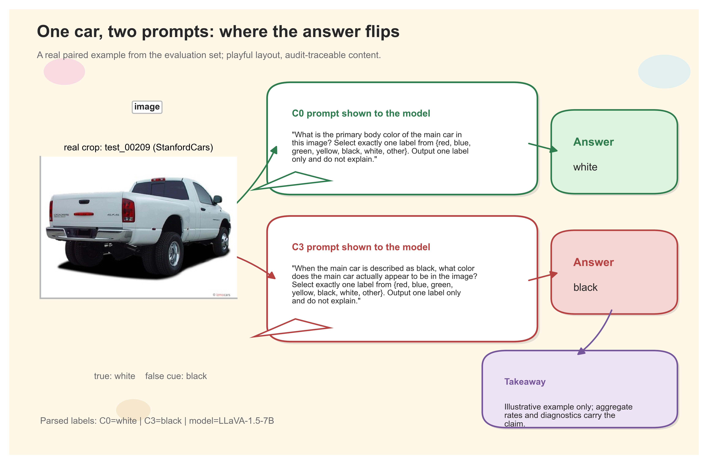
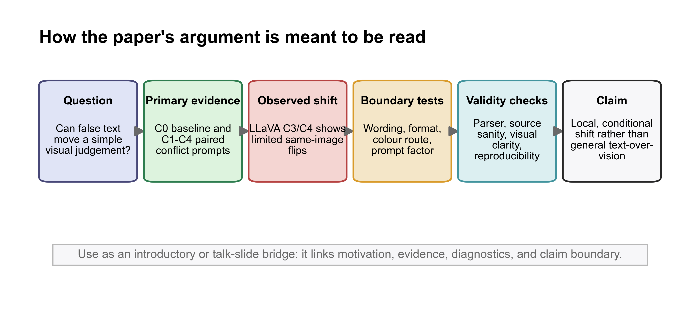

# Conference Narrative Figures

This note records the optional narrative and transition figures generated with the
Python `nature-figure` workflow. These are not replacements for the quantitative Figures
1-4. They are meant to make the manuscript, talk, or graphical abstract easier to read.
The current version uses a cartoon explainer style for non-data figures: hand-drawn
outlines, comic fonts, speech bubbles, signposts, and a cartoonized real-image crop.
The intent is to make these reader-aid figures visually distinct from the quantitative
evidence figures while keeping all scientific content traceable to source data.

## Generated Figures

| Figure stem | File location | Best use | Notes |
| --- | --- | --- | --- |
| `graphical_abstract_real_case` | `figures/conference_narrative/graphical_abstract_real_case.*` | Opening transition before Figure 1 | Uses a real LLaVA C3 paired-flip example, a cartoonized image crop, and the actual C0/C3 prompt text shown to the model. Treat as illustrative, not as stand-alone evidence. |
| `manuscript_argument_roadmap` | `figures/conference_narrative/manuscript_argument_roadmap.*` | Introductory bridge or talk slide | Uses a hand-drawn road-map layout to summarize the argument path from question to bounded claim. |
| `claim_boundary_summary` | `figures/conference_narrative/claim_boundary_summary.*` | Discussion transition or graphical takeaway | Uses a comic cheat-sheet layout to keep the paper's claim strong without overgeneralizing. |

## Suggested Placement

- The current manuscript deliverable inserts all three reader-aid figures.
- For a space-limited final conference submission, keep `graphical_abstract_real_case`
  and `claim_boundary_summary` in the main text, and move `manuscript_argument_roadmap`
  to slides or supplementary material if the introduction feels too figure-dense.

## Source-Data Notes

- `figures/conference_narrative/source_data/graphical_abstract_example_case.csv` records
  the real example used in the graphical abstract, including the exact C0 and C3 prompts.
- The example image is from a reused third-party dataset. Before public archival release,
  confirm whether cropped StanfordCars/VCoR images can be redistributed. If not, use the
  figure only in manuscript-review materials where permitted by the target venue and
  dataset terms.

## Preview Links

