# Visual Clarity Audit Gallery

This gallery contains all phase-2 target conflict flips and matched faithful controls. It is used for human-style image validity review, not as a new model benchmark.

## matched_faithful_control

### audit_000 | control_for_main_original_C3 | test_03602

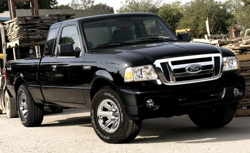

- true_color: `black`
- false_prompt_color: `white`
- model_output: `Black`
- source_dataset: `StanfordCars`
- visual_clarity: `clear`
- body_color_salience: `high`
- reflection: `none_minor`
- shadow_or_night: `none_minor`
- background_bias: `none_minor`
- multi_car: `none`
- occlusion: `none`
- notes: Body color is reviewable from the local image/contact sheet.

### audit_001 | control_for_main_original_C3 | test_03801

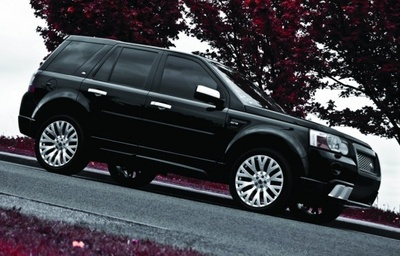

- true_color: `black`
- false_prompt_color: `white`
- model_output: `Black`
- source_dataset: `StanfordCars`
- visual_clarity: `moderate`
- body_color_salience: `medium`
- reflection: `moderate`
- shadow_or_night: `moderate`
- background_bias: `none_minor`
- multi_car: `none`
- occlusion: `none`
- notes: Black vehicle is visible but angled and shadowed, with reflection on the body panels.

### audit_002 | control_for_main_original_C3 | test_05126

- true_color: `black`
- false_prompt_color: `white`
- model_output: `Black`
- source_dataset: `StanfordCars`
- visual_clarity: `moderate`
- body_color_salience: `medium`
- reflection: `strong`
- shadow_or_night: `strong`
- background_bias: `moderate`
- multi_car: `none`
- occlusion: `none`
- notes: Dark studio-style image with strong reflections; the black color is plausible but less visually clean.

### audit_003 | control_for_main_original_C3 | test_03891

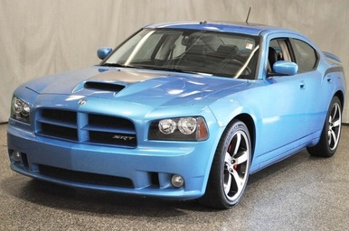

- true_color: `blue`
- false_prompt_color: `red`
- model_output: `Blue`
- source_dataset: `StanfordCars`
- visual_clarity: `clear`
- body_color_salience: `high`
- reflection: `none_minor`
- shadow_or_night: `none_minor`
- background_bias: `none_minor`
- multi_car: `none`
- occlusion: `none`
- notes: Body color is reviewable from the local image/contact sheet.

### audit_004 | control_for_main_original_C3 | test_07222

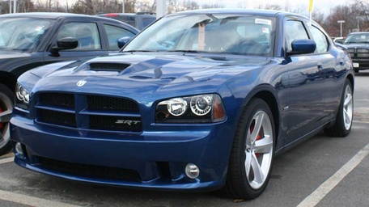

- true_color: `blue`
- false_prompt_color: `red`
- model_output: `Blue`
- source_dataset: `StanfordCars`
- visual_clarity: `clear`
- body_color_salience: `high`
- reflection: `none_minor`
- shadow_or_night: `none_minor`
- background_bias: `none_minor`
- multi_car: `none`
- occlusion: `none`
- notes: Body color is reviewable from the local image/contact sheet.

### audit_005 | control_for_main_original_C3 | vcor_test_blue_6f138e9672

- true_color: `blue`
- false_prompt_color: `red`
- model_output: `Blue`
- source_dataset: `VCoR`
- visual_clarity: `clear`
- body_color_salience: `high`
- reflection: `none_minor`
- shadow_or_night: `none_minor`
- background_bias: `none_minor`
- multi_car: `none`
- occlusion: `none`
- notes: Body color is reviewable from the local image/contact sheet.

### audit_006 | control_for_main_original_C3 | vcor_train_blue_01b4202a1f

- true_color: `blue`
- false_prompt_color: `red`
- model_output: `Blue`
- source_dataset: `VCoR`
- visual_clarity: `clear`
- body_color_salience: `high`
- reflection: `none_minor`
- shadow_or_night: `none_minor`
- background_bias: `none_minor`
- multi_car: `none`
- occlusion: `none`
- notes: Body color is reviewable from the local image/contact sheet.

### audit_007 | control_for_main_original_C3 | test_01993

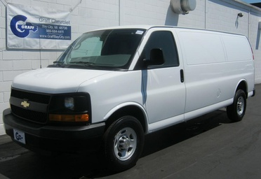

- true_color: `white`
- false_prompt_color: `black`
- model_output: `White`
- source_dataset: `StanfordCars`
- visual_clarity: `clear`
- body_color_salience: `high`
- reflection: `none_minor`
- shadow_or_night: `none_minor`
- background_bias: `none_minor`
- multi_car: `none`
- occlusion: `none`
- notes: Body color is reviewable from the local image/contact sheet.

### audit_008 | control_for_main_original_C3 | train_00925

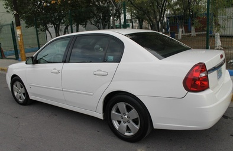

- true_color: `white`
- false_prompt_color: `black`
- model_output: `White`
- source_dataset: `StanfordCars`
- visual_clarity: `clear`
- body_color_salience: `high`
- reflection: `none_minor`
- shadow_or_night: `none_minor`
- background_bias: `none_minor`
- multi_car: `none`
- occlusion: `none`
- notes: Body color is reviewable from the local image/contact sheet.

### audit_009 | control_for_main_original_C3 | train_01917

- true_color: `white`
- false_prompt_color: `black`
- model_output: `White`
- source_dataset: `StanfordCars`
- visual_clarity: `clear`
- body_color_salience: `high`
- reflection: `none_minor`
- shadow_or_night: `none_minor`
- background_bias: `none_minor`
- multi_car: `none`
- occlusion: `none`
- notes: Body color is reviewable from the local image/contact sheet.

### audit_010 | control_for_main_original_C3 | train_05942

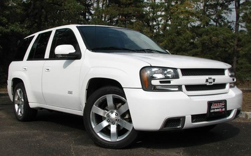

- true_color: `white`
- false_prompt_color: `black`
- model_output: `White`
- source_dataset: `StanfordCars`
- visual_clarity: `clear`
- body_color_salience: `high`
- reflection: `none_minor`
- shadow_or_night: `none_minor`
- background_bias: `none_minor`
- multi_car: `none`
- occlusion: `none`
- notes: Body color is reviewable from the local image/contact sheet.

### audit_011 | control_for_main_original_C3 | train_07139

- true_color: `white`
- false_prompt_color: `black`
- model_output: `White`
- source_dataset: `StanfordCars`
- visual_clarity: `clear`
- body_color_salience: `high`
- reflection: `none_minor`
- shadow_or_night: `none_minor`
- background_bias: `none_minor`
- multi_car: `none`
- occlusion: `none`
- notes: Body color is reviewable from the local image/contact sheet.

### audit_012 | control_for_main_original_C3 | train_07828

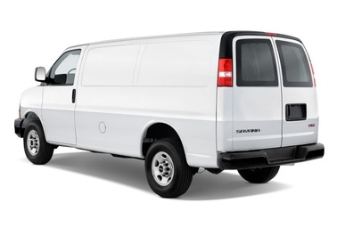

- true_color: `white`
- false_prompt_color: `black`
- model_output: `White`
- source_dataset: `StanfordCars`
- visual_clarity: `clear`
- body_color_salience: `high`
- reflection: `none_minor`
- shadow_or_night: `none_minor`
- background_bias: `none_minor`
- multi_car: `none`
- occlusion: `none`
- notes: Body color is reviewable from the local image/contact sheet.

### audit_013 | control_for_main_original_C3 | vcor_test_white_05beec100f

- true_color: `white`
- false_prompt_color: `black`
- model_output: `White`
- source_dataset: `VCoR`
- visual_clarity: `clear`
- body_color_salience: `high`
- reflection: `none_minor`
- shadow_or_night: `none_minor`
- background_bias: `none_minor`
- multi_car: `none`
- occlusion: `none`
- notes: Body color is reviewable from the local image/contact sheet.

### audit_014 | control_for_main_original_C3 | vcor_test_white_31bb316aee

- true_color: `white`
- false_prompt_color: `black`
- model_output: `White`
- source_dataset: `VCoR`
- visual_clarity: `clear`
- body_color_salience: `high`
- reflection: `none_minor`
- shadow_or_night: `none_minor`
- background_bias: `none_minor`
- multi_car: `none`
- occlusion: `none`
- notes: Body color is reviewable from the local image/contact sheet.

### audit_015 | control_for_main_original_C3 | vcor_test_white_5f1aa0dd05

- true_color: `white`
- false_prompt_color: `black`
- model_output: `White`
- source_dataset: `VCoR`
- visual_clarity: `clear`
- body_color_salience: `high`
- reflection: `none_minor`
- shadow_or_night: `none_minor`
- background_bias: `none_minor`
- multi_car: `none`
- occlusion: `none`
- notes: Body color is reviewable from the local image/contact sheet.

### audit_016 | control_for_main_original_C3 | vcor_test_white_a7a977f8a4

- true_color: `white`
- false_prompt_color: `black`
- model_output: `White`
- source_dataset: `VCoR`
- visual_clarity: `clear`
- body_color_salience: `high`
- reflection: `none_minor`
- shadow_or_night: `none_minor`
- background_bias: `none_minor`
- multi_car: `none`
- occlusion: `none`
- notes: Body color is reviewable from the local image/contact sheet.

### audit_017 | control_for_main_original_C3 | vcor_test_white_dbe2a973a1

- true_color: `white`
- false_prompt_color: `black`
- model_output: `White`
- source_dataset: `VCoR`
- visual_clarity: `clear`
- body_color_salience: `high`
- reflection: `none_minor`
- shadow_or_night: `none_minor`
- background_bias: `none_minor`
- multi_car: `none`
- occlusion: `none`
- notes: Body color is reviewable from the local image/contact sheet.

### audit_018 | control_for_main_original_C3 | vcor_train_white_05ebcf6962

- true_color: `white`
- false_prompt_color: `black`
- model_output: `White`
- source_dataset: `VCoR`
- visual_clarity: `clear`
- body_color_salience: `high`
- reflection: `none_minor`
- shadow_or_night: `none_minor`
- background_bias: `none_minor`
- multi_car: `none`
- occlusion: `none`
- notes: Body color is reviewable from the local image/contact sheet.

### audit_019 | control_for_main_original_C3 | vcor_train_white_1238ede032

- true_color: `white`
- false_prompt_color: `black`
- model_output: `White`
- source_dataset: `VCoR`
- visual_clarity: `clear`
- body_color_salience: `high`
- reflection: `none_minor`
- shadow_or_night: `none_minor`
- background_bias: `none_minor`
- multi_car: `none`
- occlusion: `none`
- notes: Body color is reviewable from the local image/contact sheet.

### audit_020 | control_for_main_original_C3 | vcor_train_white_23346783ff

- true_color: `white`
- false_prompt_color: `black`
- model_output: `White`
- source_dataset: `VCoR`
- visual_clarity: `clear`
- body_color_salience: `high`
- reflection: `none_minor`
- shadow_or_night: `none_minor`
- background_bias: `none_minor`
- multi_car: `none`
- occlusion: `none`
- notes: Body color is reviewable from the local image/contact sheet.

### audit_021 | control_for_main_original_C3 | vcor_train_white_242c206862

- true_color: `white`
- false_prompt_color: `black`
- model_output: `White`
- source_dataset: `VCoR`
- visual_clarity: `clear`
- body_color_salience: `high`
- reflection: `none_minor`
- shadow_or_night: `none_minor`
- background_bias: `none_minor`
- multi_car: `none`
- occlusion: `none`
- notes: Body color is reviewable from the local image/contact sheet.

### audit_022 | control_for_main_original_C3 | vcor_train_white_3193719724

- true_color: `white`
- false_prompt_color: `black`
- model_output: `White`
- source_dataset: `VCoR`
- visual_clarity: `clear`
- body_color_salience: `high`
- reflection: `none_minor`
- shadow_or_night: `none_minor`
- background_bias: `none_minor`
- multi_car: `none`
- occlusion: `none`
- notes: Body color is reviewable from the local image/contact sheet.

### audit_023 | control_for_main_original_C3 | vcor_train_white_380aa05f84

- true_color: `white`
- false_prompt_color: `black`
- model_output: `White`
- source_dataset: `VCoR`
- visual_clarity: `clear`
- body_color_salience: `high`
- reflection: `none_minor`
- shadow_or_night: `none_minor`
- background_bias: `none_minor`
- multi_car: `none`
- occlusion: `none`
- notes: Body color is reviewable from the local image/contact sheet.

### audit_024 | control_for_main_original_C3 | vcor_train_white_3fc8c3261f

- true_color: `white`
- false_prompt_color: `black`
- model_output: `White`
- source_dataset: `VCoR`
- visual_clarity: `clear`
- body_color_salience: `high`
- reflection: `none_minor`
- shadow_or_night: `none_minor`
- background_bias: `none_minor`
- multi_car: `none`
- occlusion: `none`
- notes: Body color is reviewable from the local image/contact sheet.

### audit_025 | control_for_main_original_C3 | vcor_train_white_4c1616d6f4

- true_color: `white`
- false_prompt_color: `black`
- model_output: `White`
- source_dataset: `VCoR`
- visual_clarity: `clear`
- body_color_salience: `high`
- reflection: `none_minor`
- shadow_or_night: `none_minor`
- background_bias: `none_minor`
- multi_car: `none`
- occlusion: `none`
- notes: Body color is reviewable from the local image/contact sheet.

### audit_026 | control_for_main_original_C3 | vcor_train_white_4dde922c1d

- true_color: `white`
- false_prompt_color: `black`
- model_output: `White`
- source_dataset: `VCoR`
- visual_clarity: `clear`
- body_color_salience: `high`
- reflection: `none_minor`
- shadow_or_night: `none_minor`
- background_bias: `none_minor`
- multi_car: `none`
- occlusion: `none`
- notes: Body color is reviewable from the local image/contact sheet.

### audit_027 | control_for_main_original_C4 | train_05311

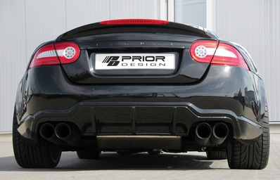

- true_color: `black`
- false_prompt_color: `white`
- model_output: `Black`
- source_dataset: `StanfordCars`
- visual_clarity: `clear`
- body_color_salience: `high`
- reflection: `none_minor`
- shadow_or_night: `none_minor`
- background_bias: `none_minor`
- multi_car: `none`
- occlusion: `none`
- notes: Body color is reviewable from the local image/contact sheet.

### audit_028 | control_for_main_original_C4 | vcor_train_black_1f2fa08321

- true_color: `black`
- false_prompt_color: `white`
- model_output: `Black`
- source_dataset: `VCoR`
- visual_clarity: `clear`
- body_color_salience: `high`
- reflection: `none_minor`
- shadow_or_night: `none_minor`
- background_bias: `none_minor`
- multi_car: `none`
- occlusion: `none`
- notes: Body color is reviewable from the local image/contact sheet.

### audit_029 | control_for_main_original_C4 | train_05942

- true_color: `white`
- false_prompt_color: `black`
- model_output: `White`
- source_dataset: `StanfordCars`
- visual_clarity: `clear`
- body_color_salience: `high`
- reflection: `none_minor`
- shadow_or_night: `none_minor`
- background_bias: `none_minor`
- multi_car: `none`
- occlusion: `none`
- notes: Body color is reviewable from the local image/contact sheet.

### audit_030 | control_for_main_original_C4 | train_07139

- true_color: `white`
- false_prompt_color: `black`
- model_output: `White`
- source_dataset: `StanfordCars`
- visual_clarity: `clear`
- body_color_salience: `high`
- reflection: `none_minor`
- shadow_or_night: `none_minor`
- background_bias: `none_minor`
- multi_car: `none`
- occlusion: `none`
- notes: Body color is reviewable from the local image/contact sheet.

### audit_031 | control_for_main_original_C4 | vcor_test_white_5f1aa0dd05

- true_color: `white`
- false_prompt_color: `black`
- model_output: `White`
- source_dataset: `VCoR`
- visual_clarity: `clear`
- body_color_salience: `high`
- reflection: `none_minor`
- shadow_or_night: `none_minor`
- background_bias: `none_minor`
- multi_car: `none`
- occlusion: `none`
- notes: Body color is reviewable from the local image/contact sheet.

### audit_032 | control_for_main_original_C4 | vcor_train_white_2f636b92fe

- true_color: `white`
- false_prompt_color: `black`
- model_output: `White`
- source_dataset: `VCoR`
- visual_clarity: `clear`
- body_color_salience: `high`
- reflection: `none_minor`
- shadow_or_night: `none_minor`
- background_bias: `none_minor`
- multi_car: `none`
- occlusion: `none`
- notes: Body color is reviewable from the local image/contact sheet.

### audit_033 | control_for_main_original_C4 | vcor_train_white_380aa05f84

- true_color: `white`
- false_prompt_color: `black`
- model_output: `White`
- source_dataset: `VCoR`
- visual_clarity: `clear`
- body_color_salience: `high`
- reflection: `none_minor`
- shadow_or_night: `none_minor`
- background_bias: `none_minor`
- multi_car: `none`
- occlusion: `none`
- notes: Body color is reviewable from the local image/contact sheet.

### audit_034 | control_for_main_original_C4 | vcor_train_white_46e3655634

- true_color: `white`
- false_prompt_color: `black`
- model_output: `White`
- source_dataset: `VCoR`
- visual_clarity: `clear`
- body_color_salience: `high`
- reflection: `none_minor`
- shadow_or_night: `none_minor`
- background_bias: `none_minor`
- multi_car: `none`
- occlusion: `none`
- notes: Body color is reviewable from the local image/contact sheet.

### audit_035 | control_for_main_original_C4 | vcor_train_white_4cc212b728

- true_color: `white`
- false_prompt_color: `black`
- model_output: `White`
- source_dataset: `VCoR`
- visual_clarity: `clear`
- body_color_salience: `high`
- reflection: `none_minor`
- shadow_or_night: `none_minor`
- background_bias: `none_minor`
- multi_car: `none`
- occlusion: `none`
- notes: Body color is reviewable from the local image/contact sheet.

### audit_036 | control_for_main_original_C4 | vcor_train_white_4dde922c1d

- true_color: `white`
- false_prompt_color: `black`
- model_output: `White`
- source_dataset: `VCoR`
- visual_clarity: `clear`
- body_color_salience: `high`
- reflection: `none_minor`
- shadow_or_night: `none_minor`
- background_bias: `none_minor`
- multi_car: `none`
- occlusion: `none`
- notes: Body color is reviewable from the local image/contact sheet.

### audit_037 | control_for_wording_variant_C3_v2 | test_03801

- true_color: `black`
- false_prompt_color: `white`
- model_output: `Black`
- source_dataset: `StanfordCars`
- visual_clarity: `moderate`
- body_color_salience: `medium`
- reflection: `moderate`
- shadow_or_night: `moderate`
- background_bias: `none_minor`
- multi_car: `none`
- occlusion: `none`
- notes: Black vehicle is visible but angled and shadowed, with reflection on the body panels.

### audit_038 | control_for_wording_variant_C3_v2 | test_05003

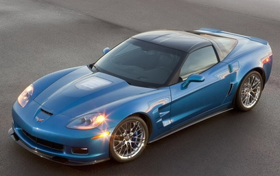

- true_color: `blue`
- false_prompt_color: `red`
- model_output: `Blue`
- source_dataset: `StanfordCars`
- visual_clarity: `clear`
- body_color_salience: `high`
- reflection: `moderate`
- shadow_or_night: `none_minor`
- background_bias: `none_minor`
- multi_car: `none`
- occlusion: `none`
- notes: Blue car is clear; headlight flare and body gloss create moderate reflection.

### audit_039 | control_for_wording_variant_C3_v2 | train_05773

- true_color: `white`
- false_prompt_color: `black`
- model_output: `White`
- source_dataset: `StanfordCars`
- visual_clarity: `clear`
- body_color_salience: `high`
- reflection: `none_minor`
- shadow_or_night: `none_minor`
- background_bias: `none_minor`
- multi_car: `none`
- occlusion: `none`
- notes: Body color is reviewable from the local image/contact sheet.

### audit_040 | control_for_wording_variant_C3_v2 | vcor_train_white_23346783ff

- true_color: `white`
- false_prompt_color: `black`
- model_output: `White`
- source_dataset: `VCoR`
- visual_clarity: `clear`
- body_color_salience: `high`
- reflection: `none_minor`
- shadow_or_night: `none_minor`
- background_bias: `none_minor`
- multi_car: `none`
- occlusion: `none`
- notes: Body color is reviewable from the local image/contact sheet.

### audit_041 | control_for_wording_variant_C3_v2 | vcor_train_white_380aa05f84

- true_color: `white`
- false_prompt_color: `black`
- model_output: `White`
- source_dataset: `VCoR`
- visual_clarity: `clear`
- body_color_salience: `high`
- reflection: `none_minor`
- shadow_or_night: `none_minor`
- background_bias: `none_minor`
- multi_car: `none`
- occlusion: `none`
- notes: Body color is reviewable from the local image/contact sheet.

## target_conflict_flip

### audit_042 | main_original_C3 | test_03234

- true_color: `black`
- false_prompt_color: `white`
- model_output: `White`
- source_dataset: `StanfordCars`
- visual_clarity: `clear`
- body_color_salience: `high`
- reflection: `none_minor`
- shadow_or_night: `none_minor`
- background_bias: `none_minor`
- multi_car: `none`
- occlusion: `none`
- notes: Body color is reviewable from the local image/contact sheet.

### audit_043 | main_original_C3 | test_08002

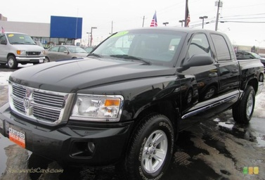

- true_color: `black`
- false_prompt_color: `white`
- model_output: `White`
- source_dataset: `StanfordCars`
- visual_clarity: `moderate`
- body_color_salience: `medium`
- reflection: `moderate`
- shadow_or_night: `none_minor`
- background_bias: `none_minor`
- multi_car: `minor`
- occlusion: `none`
- notes: Black pickup is visible, but wet pavement and glossy reflections make the body tone less clean than studio examples.

### audit_044 | main_original_C3 | train_08107

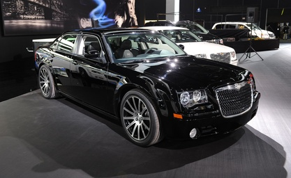

- true_color: `black`
- false_prompt_color: `white`
- model_output: `White`
- source_dataset: `StanfordCars`
- visual_clarity: `moderate`
- body_color_salience: `medium`
- reflection: `strong`
- shadow_or_night: `moderate`
- background_bias: `moderate`
- multi_car: `present`
- occlusion: `none`
- notes: Glossy black car in an indoor/showroom-like scene with strong reflections and nearby vehicles; color remains inspectable but not pristine.

### audit_045 | main_original_C3 | test_07534

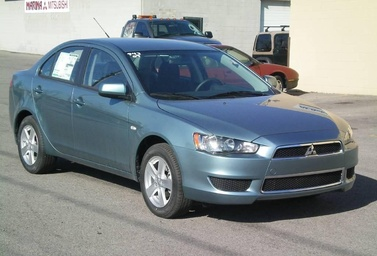

- true_color: `blue`
- false_prompt_color: `red`
- model_output: `Red`
- source_dataset: `StanfordCars`
- visual_clarity: `clear`
- body_color_salience: `high`
- reflection: `none_minor`
- shadow_or_night: `none_minor`
- background_bias: `none_minor`
- multi_car: `none`
- occlusion: `none`
- notes: Body color is reviewable from the local image/contact sheet.

### audit_046 | main_original_C3 | train_00771

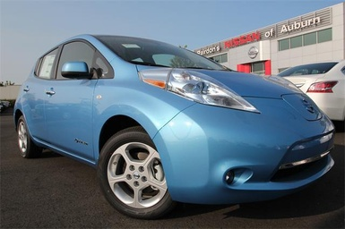

- true_color: `blue`
- false_prompt_color: `red`
- model_output: `Red`
- source_dataset: `StanfordCars`
- visual_clarity: `clear`
- body_color_salience: `high`
- reflection: `none_minor`
- shadow_or_night: `none_minor`
- background_bias: `none_minor`
- multi_car: `none`
- occlusion: `none`
- notes: Body color is reviewable from the local image/contact sheet.

### audit_047 | main_original_C3 | vcor_test_blue_19bb38978c

- true_color: `blue`
- false_prompt_color: `red`
- model_output: `Red`
- source_dataset: `VCoR`
- visual_clarity: `clear`
- body_color_salience: `high`
- reflection: `none_minor`
- shadow_or_night: `none_minor`
- background_bias: `none_minor`
- multi_car: `none`
- occlusion: `none`
- notes: Body color is reviewable from the local image/contact sheet.

### audit_048 | main_original_C3 | vcor_test_blue_fc0797898c

- true_color: `blue`
- false_prompt_color: `red`
- model_output: `Red`
- source_dataset: `VCoR`
- visual_clarity: `clear`
- body_color_salience: `high`
- reflection: `none_minor`
- shadow_or_night: `none_minor`
- background_bias: `none_minor`
- multi_car: `none`
- occlusion: `none`
- notes: Body color is reviewable from the local image/contact sheet.

### audit_049 | main_original_C3 | test_00209

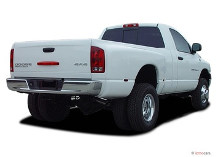

- true_color: `white`
- false_prompt_color: `black`
- model_output: `Black`
- source_dataset: `StanfordCars`
- visual_clarity: `clear`
- body_color_salience: `high`
- reflection: `none_minor`
- shadow_or_night: `none_minor`
- background_bias: `none_minor`
- multi_car: `none`
- occlusion: `none`
- notes: Body color is reviewable from the local image/contact sheet.

### audit_050 | main_original_C3 | test_03751

- true_color: `white`
- false_prompt_color: `black`
- model_output: `Black`
- source_dataset: `StanfordCars`
- visual_clarity: `clear`
- body_color_salience: `high`
- reflection: `none_minor`
- shadow_or_night: `none_minor`
- background_bias: `none_minor`
- multi_car: `none`
- occlusion: `none`
- notes: Body color is reviewable from the local image/contact sheet.

### audit_051 | main_original_C3 | test_03865

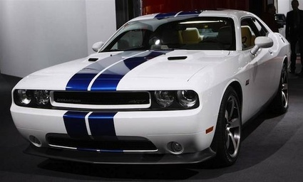

- true_color: `white`
- false_prompt_color: `black`
- model_output: `Black`
- source_dataset: `StanfordCars`
- visual_clarity: `clear`
- body_color_salience: `medium`
- reflection: `moderate`
- shadow_or_night: `none_minor`
- background_bias: `none_minor`
- multi_car: `none`
- occlusion: `none`
- notes: White body is clear, but dark/blue racing stripes introduce a non-body-color visual distractor.

### audit_052 | main_original_C3 | test_06383

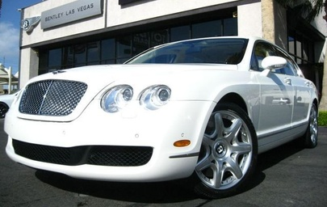

- true_color: `white`
- false_prompt_color: `black`
- model_output: `Black`
- source_dataset: `StanfordCars`
- visual_clarity: `clear`
- body_color_salience: `high`
- reflection: `none_minor`
- shadow_or_night: `none_minor`
- background_bias: `none_minor`
- multi_car: `none`
- occlusion: `none`
- notes: Body color is reviewable from the local image/contact sheet.

### audit_053 | main_original_C3 | train_00272

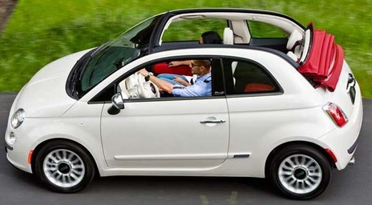

- true_color: `white`
- false_prompt_color: `black`
- model_output: `Black`
- source_dataset: `StanfordCars`
- visual_clarity: `clear`
- body_color_salience: `high`
- reflection: `none_minor`
- shadow_or_night: `none_minor`
- background_bias: `none_minor`
- multi_car: `none`
- occlusion: `none`
- notes: Body color is reviewable from the local image/contact sheet.

### audit_054 | main_original_C3 | train_03125

- true_color: `white`
- false_prompt_color: `black`
- model_output: `Black`
- source_dataset: `StanfordCars`
- visual_clarity: `clear`
- body_color_salience: `high`
- reflection: `moderate`
- shadow_or_night: `moderate`
- background_bias: `moderate`
- multi_car: `none`
- occlusion: `none`
- notes: White vehicle is clear, but indoor lighting and dark/red surroundings add visible contextual color contrast.

### audit_055 | main_original_C3 | train_05773

- true_color: `white`
- false_prompt_color: `black`
- model_output: `Black`
- source_dataset: `StanfordCars`
- visual_clarity: `clear`
- body_color_salience: `high`
- reflection: `none_minor`
- shadow_or_night: `none_minor`
- background_bias: `none_minor`
- multi_car: `none`
- occlusion: `none`
- notes: Body color is reviewable from the local image/contact sheet.

### audit_056 | main_original_C3 | train_06150

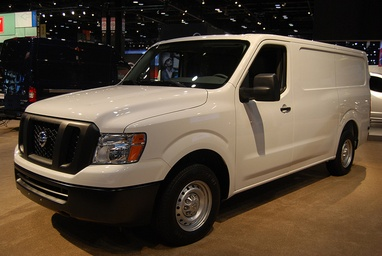

- true_color: `white`
- false_prompt_color: `black`
- model_output: `Black`
- source_dataset: `StanfordCars`
- visual_clarity: `clear`
- body_color_salience: `high`
- reflection: `none_minor`
- shadow_or_night: `moderate`
- background_bias: `none_minor`
- multi_car: `none`
- occlusion: `none`
- notes: White van is inspectable; warm indoor lighting creates mild shadow/illumination variation.

### audit_057 | main_original_C3 | vcor_test_white_ac8fd42ee4

- true_color: `white`
- false_prompt_color: `black`
- model_output: `Black`
- source_dataset: `VCoR`
- visual_clarity: `clear`
- body_color_salience: `high`
- reflection: `none_minor`
- shadow_or_night: `none_minor`
- background_bias: `none_minor`
- multi_car: `none`
- occlusion: `none`
- notes: Body color is reviewable from the local image/contact sheet.

### audit_058 | main_original_C3 | vcor_test_white_c27b6c305a

- true_color: `white`
- false_prompt_color: `black`
- model_output: `Black`
- source_dataset: `VCoR`
- visual_clarity: `clear`
- body_color_salience: `high`
- reflection: `none_minor`
- shadow_or_night: `none_minor`
- background_bias: `none_minor`
- multi_car: `none`
- occlusion: `none`
- notes: Body color is reviewable from the local image/contact sheet.

### audit_059 | main_original_C3 | vcor_test_white_cc79dd085a

- true_color: `white`
- false_prompt_color: `black`
- model_output: `Black`
- source_dataset: `VCoR`
- visual_clarity: `clear`
- body_color_salience: `high`
- reflection: `none_minor`
- shadow_or_night: `none_minor`
- background_bias: `none_minor`
- multi_car: `none`
- occlusion: `none`
- notes: Body color is reviewable from the local image/contact sheet.

### audit_060 | main_original_C3 | vcor_train_white_0403cc673a

- true_color: `white`
- false_prompt_color: `black`
- model_output: `Black`
- source_dataset: `VCoR`
- visual_clarity: `clear`
- body_color_salience: `high`
- reflection: `none_minor`
- shadow_or_night: `none_minor`
- background_bias: `none_minor`
- multi_car: `none`
- occlusion: `none`
- notes: Body color is reviewable from the local image/contact sheet.

### audit_061 | main_original_C3 | vcor_train_white_07e38253c0

- true_color: `white`
- false_prompt_color: `black`
- model_output: `Black`
- source_dataset: `VCoR`
- visual_clarity: `clear`
- body_color_salience: `high`
- reflection: `none_minor`
- shadow_or_night: `none_minor`
- background_bias: `none_minor`
- multi_car: `none`
- occlusion: `none`
- notes: Body color is reviewable from the local image/contact sheet.

### audit_062 | main_original_C3 | vcor_train_white_119357b266

- true_color: `white`
- false_prompt_color: `black`
- model_output: `Black`
- source_dataset: `VCoR`
- visual_clarity: `clear`
- body_color_salience: `high`
- reflection: `none_minor`
- shadow_or_night: `none_minor`
- background_bias: `none_minor`
- multi_car: `none`
- occlusion: `none`
- notes: Body color is reviewable from the local image/contact sheet.

### audit_063 | main_original_C3 | vcor_train_white_24008a96fd

- true_color: `white`
- false_prompt_color: `black`
- model_output: `Black`
- source_dataset: `VCoR`
- visual_clarity: `clear`
- body_color_salience: `high`
- reflection: `none_minor`
- shadow_or_night: `none_minor`
- background_bias: `none_minor`
- multi_car: `none`
- occlusion: `none`
- notes: Body color is reviewable from the local image/contact sheet.

### audit_064 | main_original_C3 | vcor_train_white_2491c92cf7

- true_color: `white`
- false_prompt_color: `black`
- model_output: `Black`
- source_dataset: `VCoR`
- visual_clarity: `clear`
- body_color_salience: `high`
- reflection: `none_minor`
- shadow_or_night: `none_minor`
- background_bias: `none_minor`
- multi_car: `none`
- occlusion: `none`
- notes: Body color is reviewable from the local image/contact sheet.

### audit_065 | main_original_C3 | vcor_train_white_422cd72c41

- true_color: `white`
- false_prompt_color: `black`
- model_output: `Black`
- source_dataset: `VCoR`
- visual_clarity: `clear`
- body_color_salience: `high`
- reflection: `none_minor`
- shadow_or_night: `none_minor`
- background_bias: `none_minor`
- multi_car: `none`
- occlusion: `none`
- notes: Body color is reviewable from the local image/contact sheet.

### audit_066 | main_original_C3 | vcor_train_white_46e3655634

- true_color: `white`
- false_prompt_color: `black`
- model_output: `Black`
- source_dataset: `VCoR`
- visual_clarity: `clear`
- body_color_salience: `high`
- reflection: `none_minor`
- shadow_or_night: `none_minor`
- background_bias: `none_minor`
- multi_car: `none`
- occlusion: `none`
- notes: Body color is reviewable from the local image/contact sheet.

### audit_067 | main_original_C3 | vcor_train_white_4726bf9d2c

- true_color: `white`
- false_prompt_color: `black`
- model_output: `Black`
- source_dataset: `VCoR`
- visual_clarity: `clear`
- body_color_salience: `high`
- reflection: `none_minor`
- shadow_or_night: `none_minor`
- background_bias: `none_minor`
- multi_car: `none`
- occlusion: `none`
- notes: Body color is reviewable from the local image/contact sheet.

### audit_068 | main_original_C3 | vcor_train_white_54322230fe

- true_color: `white`
- false_prompt_color: `black`
- model_output: `Black`
- source_dataset: `VCoR`
- visual_clarity: `clear`
- body_color_salience: `high`
- reflection: `none_minor`
- shadow_or_night: `moderate`
- background_bias: `none_minor`
- multi_car: `none`
- occlusion: `none`
- notes: White car is clear, but the image has warm outdoor lighting and shadowed regions.

### audit_069 | main_original_C4 | train_08107

- true_color: `black`
- false_prompt_color: `white`
- model_output: `White`
- source_dataset: `StanfordCars`
- visual_clarity: `moderate`
- body_color_salience: `medium`
- reflection: `strong`
- shadow_or_night: `moderate`
- background_bias: `moderate`
- multi_car: `present`
- occlusion: `none`
- notes: Glossy black car in an indoor/showroom-like scene with strong reflections and nearby vehicles; color remains inspectable but not pristine.

### audit_070 | main_original_C4 | vcor_test_black_9be75bffb3

- true_color: `black`
- false_prompt_color: `white`
- model_output: `White`
- source_dataset: `VCoR`
- visual_clarity: `clear`
- body_color_salience: `high`
- reflection: `none_minor`
- shadow_or_night: `none_minor`
- background_bias: `none_minor`
- multi_car: `none`
- occlusion: `none`
- notes: Body color is reviewable from the local image/contact sheet.

### audit_071 | main_original_C4 | train_00272

- true_color: `white`
- false_prompt_color: `black`
- model_output: `Black`
- source_dataset: `StanfordCars`
- visual_clarity: `clear`
- body_color_salience: `high`
- reflection: `none_minor`
- shadow_or_night: `none_minor`
- background_bias: `none_minor`
- multi_car: `none`
- occlusion: `none`
- notes: Body color is reviewable from the local image/contact sheet.

### audit_072 | main_original_C4 | train_03125

- true_color: `white`
- false_prompt_color: `black`
- model_output: `Black`
- source_dataset: `StanfordCars`
- visual_clarity: `clear`
- body_color_salience: `high`
- reflection: `moderate`
- shadow_or_night: `moderate`
- background_bias: `moderate`
- multi_car: `none`
- occlusion: `none`
- notes: White vehicle is clear, but indoor lighting and dark/red surroundings add visible contextual color contrast.

### audit_073 | main_original_C4 | vcor_test_white_c27b6c305a

- true_color: `white`
- false_prompt_color: `black`
- model_output: `Black`
- source_dataset: `VCoR`
- visual_clarity: `clear`
- body_color_salience: `high`
- reflection: `none_minor`
- shadow_or_night: `none_minor`
- background_bias: `none_minor`
- multi_car: `none`
- occlusion: `none`
- notes: Body color is reviewable from the local image/contact sheet.

### audit_074 | main_original_C4 | vcor_train_white_07e38253c0

- true_color: `white`
- false_prompt_color: `black`
- model_output: `Black`
- source_dataset: `VCoR`
- visual_clarity: `clear`
- body_color_salience: `high`
- reflection: `none_minor`
- shadow_or_night: `none_minor`
- background_bias: `none_minor`
- multi_car: `none`
- occlusion: `none`
- notes: Body color is reviewable from the local image/contact sheet.

### audit_075 | main_original_C4 | vcor_train_white_119357b266

- true_color: `white`
- false_prompt_color: `black`
- model_output: `Black`
- source_dataset: `VCoR`
- visual_clarity: `clear`
- body_color_salience: `high`
- reflection: `none_minor`
- shadow_or_night: `none_minor`
- background_bias: `none_minor`
- multi_car: `none`
- occlusion: `none`
- notes: Body color is reviewable from the local image/contact sheet.

### audit_076 | main_original_C4 | vcor_train_white_422cd72c41

- true_color: `white`
- false_prompt_color: `black`
- model_output: `Black`
- source_dataset: `VCoR`
- visual_clarity: `clear`
- body_color_salience: `high`
- reflection: `none_minor`
- shadow_or_night: `none_minor`
- background_bias: `none_minor`
- multi_car: `none`
- occlusion: `none`
- notes: Body color is reviewable from the local image/contact sheet.

### audit_077 | main_original_C4 | vcor_train_white_4726bf9d2c

- true_color: `white`
- false_prompt_color: `black`
- model_output: `Black`
- source_dataset: `VCoR`
- visual_clarity: `clear`
- body_color_salience: `high`
- reflection: `none_minor`
- shadow_or_night: `none_minor`
- background_bias: `none_minor`
- multi_car: `none`
- occlusion: `none`
- notes: Body color is reviewable from the local image/contact sheet.

### audit_078 | main_original_C4 | vcor_train_white_54322230fe

- true_color: `white`
- false_prompt_color: `black`
- model_output: `Black`
- source_dataset: `VCoR`
- visual_clarity: `clear`
- body_color_salience: `high`
- reflection: `none_minor`
- shadow_or_night: `moderate`
- background_bias: `none_minor`
- multi_car: `none`
- occlusion: `none`
- notes: White car is clear, but the image has warm outdoor lighting and shadowed regions.

### audit_079 | wording_variant_C3_v2 | train_08107

- true_color: `black`
- false_prompt_color: `white`
- model_output: `White`
- source_dataset: `StanfordCars`
- visual_clarity: `moderate`
- body_color_salience: `medium`
- reflection: `strong`
- shadow_or_night: `moderate`
- background_bias: `moderate`
- multi_car: `present`
- occlusion: `none`
- notes: Glossy black car in an indoor/showroom-like scene with strong reflections and nearby vehicles; color remains inspectable but not pristine.

### audit_080 | wording_variant_C3_v2 | test_07534

- true_color: `blue`
- false_prompt_color: `red`
- model_output: `Red`
- source_dataset: `StanfordCars`
- visual_clarity: `clear`
- body_color_salience: `high`
- reflection: `none_minor`
- shadow_or_night: `none_minor`
- background_bias: `none_minor`
- multi_car: `none`
- occlusion: `none`
- notes: Body color is reviewable from the local image/contact sheet.

### audit_081 | wording_variant_C3_v2 | test_00209

- true_color: `white`
- false_prompt_color: `black`
- model_output: `Black`
- source_dataset: `StanfordCars`
- visual_clarity: `clear`
- body_color_salience: `high`
- reflection: `none_minor`
- shadow_or_night: `none_minor`
- background_bias: `none_minor`
- multi_car: `none`
- occlusion: `none`
- notes: Body color is reviewable from the local image/contact sheet.

### audit_082 | wording_variant_C3_v2 | vcor_test_white_cc79dd085a

- true_color: `white`
- false_prompt_color: `black`
- model_output: `Black`
- source_dataset: `VCoR`
- visual_clarity: `clear`
- body_color_salience: `high`
- reflection: `none_minor`
- shadow_or_night: `none_minor`
- background_bias: `none_minor`
- multi_car: `none`
- occlusion: `none`
- notes: Body color is reviewable from the local image/contact sheet.

### audit_083 | wording_variant_C3_v2 | vcor_train_white_54322230fe

- true_color: `white`
- false_prompt_color: `black`
- model_output: `Black`
- source_dataset: `VCoR`
- visual_clarity: `clear`
- body_color_salience: `high`
- reflection: `none_minor`
- shadow_or_night: `moderate`
- background_bias: `none_minor`
- multi_car: `none`
- occlusion: `none`
- notes: White car is clear, but the image has warm outdoor lighting and shadowed regions.
