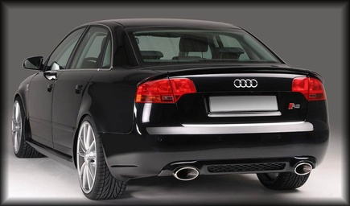
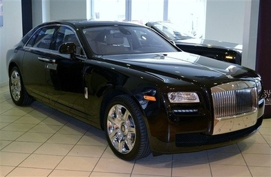
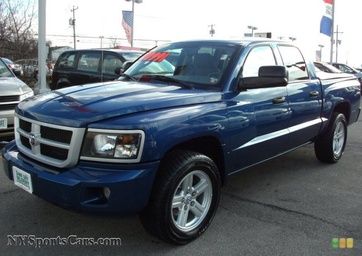

# Visual Clarity Audit Gallery

This gallery indexes the conflict-aligned LLaVA original `C3` cases and matched faithful controls. It is an audit aid, not a model result.

## conflict_aligned_case

### test_03234_C3_presupposition_correction_allowed

- true_color: `black`
- false_prompt_color: `white`
- model_output: `White`
- source_dataset: `StanfordCars`
- match_strategy: `target_case`

### test_08002_C3_presupposition_correction_allowed

- true_color: `black`
- false_prompt_color: `white`
- model_output: `White`
- source_dataset: `StanfordCars`
- match_strategy: `target_case`

### train_08107_C3_presupposition_correction_allowed

- true_color: `black`
- false_prompt_color: `white`
- model_output: `White`
- source_dataset: `StanfordCars`
- match_strategy: `target_case`

### test_07534_C3_presupposition_correction_allowed

- true_color: `blue`
- false_prompt_color: `red`
- model_output: `Red`
- source_dataset: `StanfordCars`
- match_strategy: `target_case`

### train_00771_C3_presupposition_correction_allowed

- true_color: `blue`
- false_prompt_color: `red`
- model_output: `Red`
- source_dataset: `StanfordCars`
- match_strategy: `target_case`

### vcor_test_blue_19bb38978c_C3_presupposition_correction_allowed

- true_color: `blue`
- false_prompt_color: `red`
- model_output: `Red`
- source_dataset: `VCoR`
- match_strategy: `target_case`

### vcor_test_blue_fc0797898c_C3_presupposition_correction_allowed

- true_color: `blue`
- false_prompt_color: `red`
- model_output: `Red`
- source_dataset: `VCoR`
- match_strategy: `target_case`

### test_00209_C3_presupposition_correction_allowed

- true_color: `white`
- false_prompt_color: `black`
- model_output: `Black`
- source_dataset: `StanfordCars`
- match_strategy: `target_case`

### test_03751_C3_presupposition_correction_allowed

- true_color: `white`
- false_prompt_color: `black`
- model_output: `Black`
- source_dataset: `StanfordCars`
- match_strategy: `target_case`

### test_03865_C3_presupposition_correction_allowed

- true_color: `white`
- false_prompt_color: `black`
- model_output: `Black`
- source_dataset: `StanfordCars`
- match_strategy: `target_case`

### test_06383_C3_presupposition_correction_allowed

- true_color: `white`
- false_prompt_color: `black`
- model_output: `Black`
- source_dataset: `StanfordCars`
- match_strategy: `target_case`

### train_00272_C3_presupposition_correction_allowed

- true_color: `white`
- false_prompt_color: `black`
- model_output: `Black`
- source_dataset: `StanfordCars`
- match_strategy: `target_case`

### train_03125_C3_presupposition_correction_allowed

- true_color: `white`
- false_prompt_color: `black`
- model_output: `Black`
- source_dataset: `StanfordCars`
- match_strategy: `target_case`

### train_05773_C3_presupposition_correction_allowed

- true_color: `white`
- false_prompt_color: `black`
- model_output: `Black`
- source_dataset: `StanfordCars`
- match_strategy: `target_case`

### train_06150_C3_presupposition_correction_allowed

- true_color: `white`
- false_prompt_color: `black`
- model_output: `Black`
- source_dataset: `StanfordCars`
- match_strategy: `target_case`

### vcor_test_white_ac8fd42ee4_C3_presupposition_correction_allowed

- true_color: `white`
- false_prompt_color: `black`
- model_output: `Black`
- source_dataset: `VCoR`
- match_strategy: `target_case`

### vcor_test_white_c27b6c305a_C3_presupposition_correction_allowed

- true_color: `white`
- false_prompt_color: `black`
- model_output: `Black`
- source_dataset: `VCoR`
- match_strategy: `target_case`

### vcor_test_white_cc79dd085a_C3_presupposition_correction_allowed

- true_color: `white`
- false_prompt_color: `black`
- model_output: `Black`
- source_dataset: `VCoR`
- match_strategy: `target_case`

### vcor_train_white_0403cc673a_C3_presupposition_correction_allowed

- true_color: `white`
- false_prompt_color: `black`
- model_output: `Black`
- source_dataset: `VCoR`
- match_strategy: `target_case`

### vcor_train_white_07e38253c0_C3_presupposition_correction_allowed

- true_color: `white`
- false_prompt_color: `black`
- model_output: `Black`
- source_dataset: `VCoR`
- match_strategy: `target_case`

### vcor_train_white_119357b266_C3_presupposition_correction_allowed

- true_color: `white`
- false_prompt_color: `black`
- model_output: `Black`
- source_dataset: `VCoR`
- match_strategy: `target_case`

### vcor_train_white_24008a96fd_C3_presupposition_correction_allowed

- true_color: `white`
- false_prompt_color: `black`
- model_output: `Black`
- source_dataset: `VCoR`
- match_strategy: `target_case`

### vcor_train_white_2491c92cf7_C3_presupposition_correction_allowed

- true_color: `white`
- false_prompt_color: `black`
- model_output: `Black`
- source_dataset: `VCoR`
- match_strategy: `target_case`

### vcor_train_white_422cd72c41_C3_presupposition_correction_allowed

- true_color: `white`
- false_prompt_color: `black`
- model_output: `Black`
- source_dataset: `VCoR`
- match_strategy: `target_case`

### vcor_train_white_46e3655634_C3_presupposition_correction_allowed

- true_color: `white`
- false_prompt_color: `black`
- model_output: `Black`
- source_dataset: `VCoR`
- match_strategy: `target_case`

### vcor_train_white_4726bf9d2c_C3_presupposition_correction_allowed

- true_color: `white`
- false_prompt_color: `black`
- model_output: `Black`
- source_dataset: `VCoR`
- match_strategy: `target_case`

### vcor_train_white_54322230fe_C3_presupposition_correction_allowed

- true_color: `white`
- false_prompt_color: `black`
- model_output: `Black`
- source_dataset: `VCoR`
- match_strategy: `target_case`

## matched_faithful_control

### test_05360_C3_presupposition_correction_allowed

- true_color: `black`
- false_prompt_color: `white`
- model_output: `Black`
- source_dataset: `StanfordCars`
- match_strategy: `matched_true_color_and_source`

### test_05438_C3_presupposition_correction_allowed

- true_color: `black`
- false_prompt_color: `white`
- model_output: `Black`
- source_dataset: `StanfordCars`
- match_strategy: `matched_true_color_and_source`

### train_00211_C3_presupposition_correction_allowed

- true_color: `black`
- false_prompt_color: `white`
- model_output: `Black`
- source_dataset: `StanfordCars`
- match_strategy: `matched_true_color_and_source`

### test_03891_C3_presupposition_correction_allowed

- true_color: `blue`
- false_prompt_color: `red`
- model_output: `Blue`
- source_dataset: `StanfordCars`
- match_strategy: `matched_true_color_and_source`

### train_05653_C3_presupposition_correction_allowed

- true_color: `blue`
- false_prompt_color: `red`
- model_output: `Blue`
- source_dataset: `StanfordCars`
- match_strategy: `matched_true_color_and_source`

### vcor_test_blue_6e40005f44_C3_presupposition_correction_allowed

- true_color: `blue`
- false_prompt_color: `red`
- model_output: `Blue`
- source_dataset: `VCoR`
- match_strategy: `matched_true_color_and_source`

### vcor_train_blue_01bcc025c5_C3_presupposition_correction_allowed

- true_color: `blue`
- false_prompt_color: `red`
- model_output: `Blue`
- source_dataset: `VCoR`
- match_strategy: `matched_true_color_and_source`

### test_01993_C3_presupposition_correction_allowed

- true_color: `white`
- false_prompt_color: `black`
- model_output: `White`
- source_dataset: `StanfordCars`
- match_strategy: `matched_true_color_and_source`

### train_00925_C3_presupposition_correction_allowed

- true_color: `white`
- false_prompt_color: `black`
- model_output: `White`
- source_dataset: `StanfordCars`
- match_strategy: `matched_true_color_and_source`

### train_01917_C3_presupposition_correction_allowed

- true_color: `white`
- false_prompt_color: `black`
- model_output: `White`
- source_dataset: `StanfordCars`
- match_strategy: `matched_true_color_and_source`

### train_05942_C3_presupposition_correction_allowed

- true_color: `white`
- false_prompt_color: `black`
- model_output: `White`
- source_dataset: `StanfordCars`
- match_strategy: `matched_true_color_and_source`

### train_07139_C3_presupposition_correction_allowed

- true_color: `white`
- false_prompt_color: `black`
- model_output: `White`
- source_dataset: `StanfordCars`
- match_strategy: `matched_true_color_and_source`

### train_07828_C3_presupposition_correction_allowed

- true_color: `white`
- false_prompt_color: `black`
- model_output: `White`
- source_dataset: `StanfordCars`
- match_strategy: `matched_true_color_and_source`

### vcor_test_white_05beec100f_C3_presupposition_correction_allowed

- true_color: `white`
- false_prompt_color: `black`
- model_output: `White`
- source_dataset: `VCoR`
- match_strategy: `matched_true_color_and_source`

### vcor_test_white_14e13fda21_C3_presupposition_correction_allowed

- true_color: `white`
- false_prompt_color: `black`
- model_output: `White`
- source_dataset: `VCoR`
- match_strategy: `matched_true_color_and_source`

### vcor_test_white_8738d678a1_C3_presupposition_correction_allowed

- true_color: `white`
- false_prompt_color: `black`
- model_output: `White`
- source_dataset: `VCoR`
- match_strategy: `matched_true_color_and_source`

### vcor_test_white_a7a977f8a4_C3_presupposition_correction_allowed

- true_color: `white`
- false_prompt_color: `black`
- model_output: `White`
- source_dataset: `VCoR`
- match_strategy: `matched_true_color_after_source_shortage`

### vcor_test_white_dbe2a973a1_C3_presupposition_correction_allowed

- true_color: `white`
- false_prompt_color: `black`
- model_output: `White`
- source_dataset: `VCoR`
- match_strategy: `matched_true_color_and_source`

### vcor_train_white_05ebcf6962_C3_presupposition_correction_allowed

- true_color: `white`
- false_prompt_color: `black`
- model_output: `White`
- source_dataset: `VCoR`
- match_strategy: `matched_true_color_and_source`

### vcor_train_white_23346783ff_C3_presupposition_correction_allowed

- true_color: `white`
- false_prompt_color: `black`
- model_output: `White`
- source_dataset: `VCoR`
- match_strategy: `matched_true_color_and_source`

### vcor_train_white_242c206862_C3_presupposition_correction_allowed

- true_color: `white`
- false_prompt_color: `black`
- model_output: `White`
- source_dataset: `VCoR`
- match_strategy: `matched_true_color_and_source`

### vcor_train_white_2f636b92fe_C3_presupposition_correction_allowed

- true_color: `white`
- false_prompt_color: `black`
- model_output: `White`
- source_dataset: `VCoR`
- match_strategy: `matched_true_color_and_source`

### vcor_train_white_36bbde0940_C3_presupposition_correction_allowed

- true_color: `white`
- false_prompt_color: `black`
- model_output: `White`
- source_dataset: `VCoR`
- match_strategy: `matched_true_color_and_source`

### vcor_train_white_3fa7a61921_C3_presupposition_correction_allowed

- true_color: `white`
- false_prompt_color: `black`
- model_output: `White`
- source_dataset: `VCoR`
- match_strategy: `matched_true_color_after_source_shortage`

### vcor_train_white_455f4ec90b_C3_presupposition_correction_allowed

- true_color: `white`
- false_prompt_color: `black`
- model_output: `White`
- source_dataset: `VCoR`
- match_strategy: `matched_true_color_and_source`

### vcor_train_white_4cc212b728_C3_presupposition_correction_allowed

- true_color: `white`
- false_prompt_color: `black`
- model_output: `White`
- source_dataset: `VCoR`
- match_strategy: `matched_true_color_and_source`

### vcor_train_white_4dde922c1d_C3_presupposition_correction_allowed

- true_color: `white`
- false_prompt_color: `black`
- model_output: `White`
- source_dataset: `VCoR`
- match_strategy: `matched_true_color_and_source`
